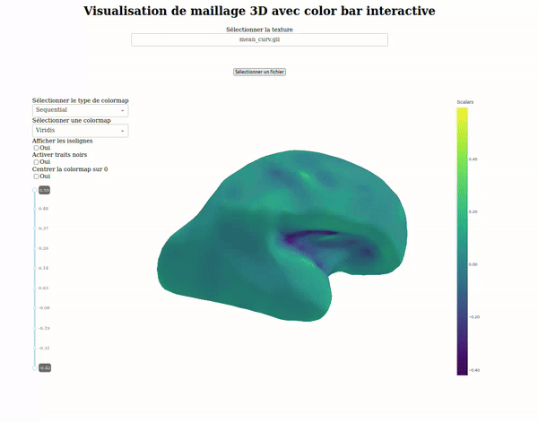

# SLAMViz: Neuroanatomical Surface Visualization

**SLAMViz** is a powerful tool for visualizing neuroanatomical surfaces, enabling users to explore and interact with 3D meshes and apply textures easly. It is built on the [MeshVisualizer](https://github.com/maximedieudonne/MeshVisualizer) tool.

<p align="center">  </p>

Examples showcased in this repository utilize data processed with the [SLAM](https://github.com/brain-slam/slam) package.

## Key Features

- **Intuitive Visualization**: Effortlessly view 3D neuroanatomical meshes.
- **Texture Mapping**: Apply and visualize textures on surface meshes.
- **Flexible Interfaces**: Use through command-line interface or Python API.

## Installation

To install the required dependencies, clone the repository and install the necessary Python packages.

```
git clone https://github.com/brain-slam/slamviz.git
cd slamviz
pip install .
```

## Usage

SLAMViz supports mesh visualization with optional textures, which can be loaded during the application launch or selected dynamically from within the interface.

### Command-Line Usage

Run the application with this command line:

```
python tools/app.py 
```

### Python Interface

Use slamviz programmatically by calling its API:

```python
from tools import app

# Example usage
mesh_file_path = "./example_data/brain_mesh.gii"
textures_path = ["./example_data/texture1.gii", "./example_data/texture2.gii"]

app.run_dash_app(mesh_file_path, textures_path)
```
